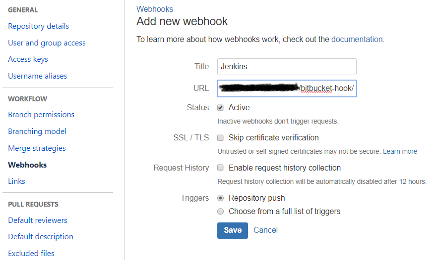

# Jenkins + Docker

### Запуск Jenkins в контейнере

Делаем Dockerfile, на основе которого собираем jenkins-контейнер с докером на борту:

```text
FROM jenkins/jenkins:lts

USER root

# Ставим докер
RUN apt-get update
RUN apt-get install \
    apt-transport-https \
    ca-certificates \
    curl \
    gnupg2 \
    software-properties-common -y
RUN curl -fsSL https://download.docker.com/linux/debian/gpg | apt-key add -
RUN add-apt-repository \
   "deb [arch=amd64] https://download.docker.com/linux/debian \
   $(lsb_release -cs) \
   stable" 
RUN apt-get update
RUN apt-get install docker-ce docker-ce-cli containerd.io -y

# Даем права на использование докера jenkins-юзеру
RUN usermod -aG docker jenkins

USER jenkins
```

Jenkins-контейнер сделан на основе Debian, соответственно Docker нужно ставить [как на Debian](https://docs.docker.com/install/linux/docker-ce/debian/)


Чтоб на локалке не запускать докер через sudo, нужно добавить себя в докер группу:

`sudo usermod -a -G docker $USER`

и переподключиться по ssh


Собираем:

```text
docker build -t jenkins-docker .
```

Запускаем собранный контейнер:

```text
docker run -p 8081:8080 -p 50000:50000 -d \
    --restart unless-stopped \
    -v /opt/jenkins_home:/var/jenkins_home \
    -v /var/run/docker.sock:/var/run/docker.sock \
    --name jenkins jenkins-docker
```

Поподробнее:

* `-p 8081:8080 -p 50000:50000` - открываем порты для внешнего мира
* `--restart unless-stopped` - перезапуск, если контейнер не застопан руками
* `-v /opt/jenkins_home:/var/jenkins_home` - связваем контейнер с директорией `/opt/jenkins_home`, чтоб все работало при перезапуске контейнера
* `-v /var/run/docker.sock:/var/run/docker.sock` - связываем докер внутри контейнера с докером на локалке, чтоб jenkins мог деплоить контейнеры на локалку
* `--name jenkins jenkins-docker` - обзываем контейнер и запускаем сборку

После запуска jenkins должен начать робить на 8081 порту

При первом запуске jenkins потребует пароль, который можно получить вызвав: 

```text
cat /opt/jenkins_home/secrets/initialAdminAndPassword
```


### Создание Item'а сборки

В данном туториале, будем делать item с типом pipeline:


В Build Trigger ставим Build when a change is pushed to BitBucket - для запуска сборки при пуше в репозиторий \(доступно с [плагином](https://plugins.jenkins.io/bitbucket)\). Также необходимо создать вебхук в BitBicket:



В Pipeline &gt; Definition указываем путь к репозиторию, где лежит Jenkinsfile \(о нем ниже\)


Если репозиторий приватный, то можно задать доступы используемые при клонировании:


**Важно задать ID**, чтобы можно было использовать доступ на этапе сборки

### Jenkinsfile

Стадии сборки можно определять в специальном файле - Jenkinsfile:

```text
node {
  stage ('Checkout') {
    environment {
          BITBUCKET_COMMON_CREDS = credentials('19c1840f-f749-47cd-b81f-74ad3c44e21d')
    }

    checkout scm
  }

  stage 'build'
  docker.build('rbcn_app_front')

  stage 'deploy'
  sh 'bash deploy.sh'
}
```

Файл выше делает следующие вещи:

* клонит репозиторий, используя доступы с созданным ранее ID
* Запускает `docker build`
* Запускает bash-скрипт, который перезапускает docker-контейнер со свежей сборкой:

```bash
#!/bin/bash
docker stop rbcn_app_front
docker rm rbcn_app_front
docker run --name rbcn_app_front -p 3001:3000 -d rbcn_app_front
```

Когда файл запушен, можно начинать сборку

### Ссылки

* [Основа](https://medium.com/@schogini/running-docker-inside-and-outside-of-a-jenkins-container-along-with-docker-compose-a-tiny-c908c21557aa)
* [Jenkins-контейнер](https://hub.docker.com/r/jenkins/jenkins/)
* [Гайд по Jenkinsfile](https://jenkins.io/doc/book/pipeline/getting-started/)


